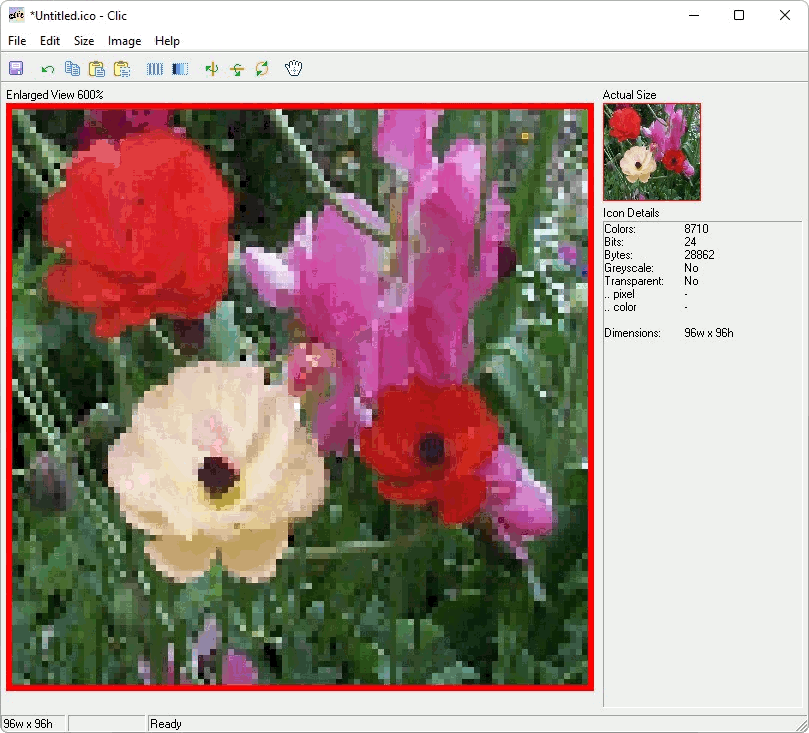
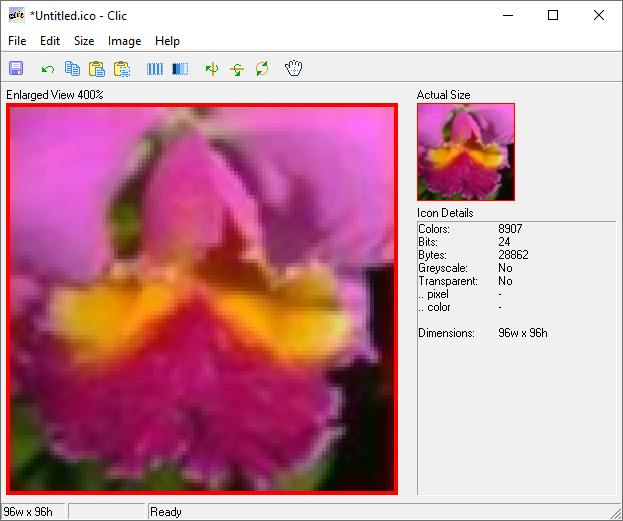
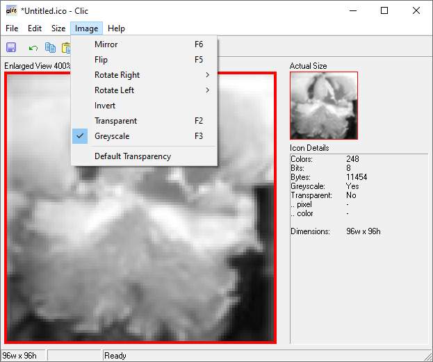
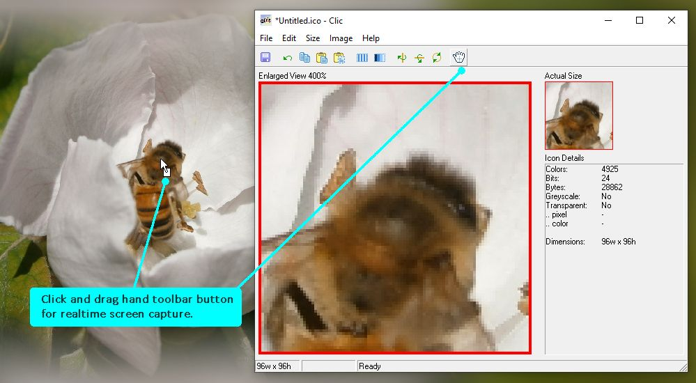

# Clic
Clic is a Clipboard To Icon Converter.  Generate stunning icons in true color (24bit, 16.7 million colors) with transparency.  Screen Capture grabs an icon from anywhere on the screen in realtime, or Paste to Fit auto resizes your picture.  So Simple!

Internet authors create your favicon.ico for website representation.

# Features
* Enlarged icon view
* Realtime WYSIWYG (What You See Is What You Get)
* Precision Screen Capture - whilst screen capturing, press space bar to toggle between normal / fine mode
* Auto format determination 1, 4, 8 and 24bit
* Multiple icon sizes - 16x16, 24x24, 32x32, 48x48, 64x64, 72x72 and 96x96
* Options: Transparency - user definable, greyscale conversion
* Icon Details: Colors, Bits, Bytes, Greyscale, Transparent, Dimensions
* Copy / Paste / Paste to Fit / Invert / Mirror / Flip
* Drag and drop images in BMP and JPG format
* Rotate Left-Right 90, 180, 270 degrees
* Help Viewer
* Sizeable
* Portable - No installation

Tip: 
Clic is portable and will run from within the folder you download it to.

Technical Note: 
An icon created with Clic may display at a different size on your Windows Desktop, because the Desktop forces all icons, regardless of actual size, to display at the Desktop's current display size setting.  For instance, if your Desktop is set to display icons at 64w x 64h, then a 32w x 32h icon will be zoomed up 200% to fit.

# Download
Download <a href="src/clic.exe">clic.exe</a> or from the "<a href="bin/">bin</a>" or "<a href="src/">src</a>" folders above.

# Images

